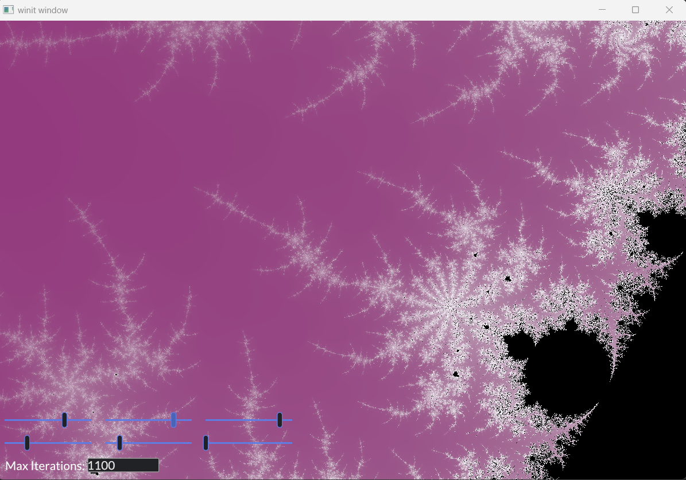

# mandelbrot (2.0)
Implementation of Mandelbrot fractal using Rust's Iced GUI Library.

I try to get fancy by creating an 'overlay' of widgets on top the fractal, similar to how controls are overlaid within a graphics engine. This is accomplished using Iced's underlying iced_winit and iced_wgpu.

## To compile:
$> cargo build

## To build and run:
$> cargo run

## Background
This project started out with my desire to learn more about OpenGL and how shaders work. As a lover of fractals, I had come across lots of articles that mentioned how the beautifully simple Mandelbrot algorithm can be parallelized. Ideally, each pixel - which can be mapped to a logical coordinate on the complex plane - can calculate its corresponding orbit - i.e. iteration steps until the coordinate escapes with a magnitude greater than 2 - as a completely independent operation. The only info that's needed is the number of iterations until escape, which is then used to compute a color. Well, what better way to compute colors per pixel than on a GPU, whose hardware was built for such a purpose? While some examples of rendering a fractal this way were around when I began looking (I started this in 2017, lol), they were all written in C/C++, which was for the longest time the only way to use OpenGL and glsl. I wanted to use Rust though, and thought this could be a great way to learn that language, along with some newer graphics libraries that were making their way into the (at the time VERY new) Rust ecosystem.

A tremendous amount has changed, of course, in the eight years since I started this, and Rust is making its way onto the scene in a big way, especially for game development and 3d graphics applications. When I switched to the Iced GUI library, I wasn't so sure it would last, but that seemed to be a good decision, and it was one of the few graphics libraries where I could find examples of overlaying on top of a GL canvas - like how settings/controls do inside a video game. In my first version, I didn't even bother with this, as one could already use the mouse quite nicely to move the fractal around and zoom - and I just used key bindings for some other settings. Already, I felt that effort was hugely impressive, as using the GPU to all the heavy lifting makes it SO much faster than any code running on the CPU. Now a-adays that seems to be even more true with current Nvidia cards, which have over 10,000 cores! That's 10k+ Mandelbrot orbit calculations running in parallel! GPU programming comes with its own set of drawbacks, of course, and the largest being - for this particular problem - the fact that we must use a GL shader language to do all the most important fractal math, and NOT C code - or in my case Rust! Still, I think Rust has a lot to offer, even in a graphics application, as there is no way around all the complexity in setting up a render pipeline to the graphics hardware - and if anything, graphics APIs are trying to get even closer to the hardware, with libraries like Vulcan and Metal. 

In that vain, Wgpu hides very little about the workings of the graphics hardware, and as such, has a pretty steep learning curve, but that was a big reason why I started this! It offers some great abstractions though, and is already portable across all major operating systems! Rust itself it also very portable, and has from the very beginning, had an incredible package management system for managing library dependencies in your code. 

**In truth, all you need to do to run this program if you don't have Rust is to simply download the rustup shell script from [rust-lang.org](https://rust-lang.org/tools/install/), install rust, and then run `cargo run` from the shell once inside the project directory (where Cargo.toml is located). Cargo downloads and builds all the library dependencies, then the project, and then runs!**

Circling back, while I think there is little argument about the benefit of using the GPU to perform fractal calculations, the other major drawback is the fact these GPU cores are all float32 processors, which has been the case for vector graphics processing since the beginning. As of this writing, it seems like native float64 is a thing on RTX 50xx series, but for us poor schlubs, it could be awhile before we can pony up the $$$ for an upgrade. That, and the portability of the shader language would be completely lost. In other words, we'll likely be stuck with float32 in our shaders for some time to come.

Fortunately, there have been many discoveries in the fractal community of late for optimizing beyond the simple `Zn+1 = Zn^2 + C`, and where using f32 is still possible! See [Future Goals](https://github.com/grubertw/mandelbrot?tab=readme-ov-file#future-goals) for more details!

## A note on the current color implantation
Currently, the `sin()` function is being used to pick the colors.  The concept comes from the following article:  https://krazydad.com/tutorials/makecolors.php In efforts to reduce 'rainbow effect', I divide the iteration count by max_iterations, then multiply by a factor (defaulting to 1.0).  Taking the sin of values from 0 to 1 makes it to a little less than 1/4th the frequency (freq of a sin wave is 2pi), so I multiply by 1/2p to stretch the values to cover a quarter of the sin wave (which gives a nice curve for increasing color from 0 to 1).  The real art comes in to play for making slight changes to this frequency for each color (i.e. each color should use a slightly different frequency). 

For maximum color diversity, the phases for each color should be shifted by a factor of 2 (say 0 for red, 2 for green, and 4 for blue). Remember, the frequency of a sin wave is 2pi (which is about 6), so this spaces out the colors fairly even.

### Other citations and tributes:
Here are the examples/tutorials I followed to help me write this (2.0) version of Mandelbrot:

https://github.com/iced-rs/iced/tree/0.13.1/examples/integration

NOTE: As with all examples in Git, make sure to view the correct code that has been tagged with the correct release of Iced. Also note, Iced seems to be good at keeping breaking changes from occurring within incremental releases; i.e. all iced_* libs in the 0.13.x series should be compatible. Using a newer version of wgpu might be possible, but only if its API updates are compatible with iced_wgpu; so it's probably not a good idea.

https://sotrh.github.io/learn-wgpu/#what-is-wgpu

# Screenshots

# Future Goals
1. Perturbation theory & Series Approximation for deep zooms [Wikipedia](https://en.wikipedia.org/wiki/Plotting_algorithms_for_the_Mandelbrot_set#Perturbation_theory_and_series_approximation)
2. Additional Coloring algorithms
3. Julia sets & cubic Mandelbrot 

With each of these goals, I hope to make coinciding user interface improvements, which allow toggling of these different algorithms. What I do *not* plan on implementing are any kind of *smart toggle* to automate making the fractal look good. Primarily, this entire project is a learning exercise for myself, and for those who might want to get a sense of Rust for graphics applications and GUIs. I am really liking Iced so far, and its approach using the Elm Architecture. Unfortunately, integration and exposure to the lower-level wgpu library muddies the waters a bit, but this is something that seems to be getting better with newer releases of Iced. While it is not my primary goal to exemplify these toolkits, if someone *does* find this project a useful reference for those libraries, that is wonderful! 

I also hope to demonstrate in the near future how reference orbits can be computed on the CPU - using Rust code and arbitrary precision floats - and then fed to the fragment shader, which can then make delta calculations with 32-bit floats, and run most of the perturbation escape algorithm with these f32's. TBD on how wgsl supported types might be used when needed to account for overflow in the mantissa, or if some of these edge cases might be handed back to the CPU and rust code to handle. It is an interesting challenge, as I have not been able to locate good examples yet of Perturbation on the GPU.

Happy fractaling and happy coding!